# StockFlow - Real-Time Financial Data & Analytics Platform

[](https://www.python.org/)
[](https://kafka.apache.org/)
[](https://delta.io/)
[](https://www.postgresql.org/)
[](https://www.metabase.com/)
[](https://aws.amazon.com/s3/)
[](https://airflow.apache.org/)

An enterprise-grade, real-time financial data platform implementing the **Medallion Lakehouse Architecture** alongside a **Lambda Architecture** for batch backfilling. Designed to capture, process, aggregate, and visualize high-throughput stock and cryptocurrency trades using Finnhub WebSocket, Kafka, Delta Lake, PostgreSQL, Airflow, and Metabase.

---

## 1. System Architecture (Medallion Lakehouse + Lambda)

The platform strictly follows the Bronze-Silver-Gold medallion architecture to ensure data quality, resilience, and lightning-fast BI queries. It also features a Batch layer managed by Airflow to heal missing data.

```mermaid
graph LR
    subgraph Data_Ingestion ["1. Data Ingestion (Real-time)"]
        GEN["Finnhub WebSocket API\n(Stock & Crypto Ticks)"]
        PROD["Python Producer\n(Async, Buffered)"]
        GEN -->|Raw JSON| PROD
    end

    subgraph Kafka_Cluster ["2. Distributed Streaming"]
        TOPIC[("Kafka Topic:\nfinnhub_realtime_trades")]
        PROD -->|Produce Records| TOPIC
    end

    subgraph Medallion_Pipeline ["3. Medallion Lakehouse Pipeline"]
        BRONZE["Bronze Stream\n(Raw Data)"]
        SILVER["Silver Stream\n(Cleaned & Enriched)"]
        GOLD["Gold Stream\n(Aggregated Data Mart)"]
        
        TOPIC -->|Consume| BRONZE
        BRONZE -->|Write Parquet| S3B[AWS S3: bronze/]
        S3B -.->|Poll| SILVER
        SILVER -->|Write Delta Lake| S3S[AWS S3: silver/]
        S3S -.->|Poll| GOLD
        GOLD -->|Compute 1m OHLCV| PG[(PostgreSQL: stockflow_gold)]
    end

    subgraph Batch_Healer ["4. Airflow Batch & Healing"]
        AIRFLOW["Airflow Scheduler"]
        YAHOO["Yahoo Finance API"]
        AIRFLOW -->|Fetch History| YAHOO
        YAHOO -->|Direct Upsert| PG
    end

    subgraph Analytics_BI ["5. Analytics & Dashboard"]
        META["Metabase BI"]
        PG -->|Query| META
    end

    style GEN fill:#f9f9f9,stroke:#333,stroke-width:1px
    style PROD fill:#e1f5fe,stroke:#0288d1,stroke-width:1.5px
    style TOPIC fill:#fff3e0,stroke:#f57c00,stroke-width:2px
    style BRONZE fill:#cd7f32,stroke:#8b4513,stroke-width:1.5px
    style SILVER fill:#e0e0e0,stroke:#808080,stroke-width:1.5px
    style GOLD fill:#fff8dc,stroke:#daa520,stroke-width:1.5px
    style PG fill:#e0f2f1,stroke:#00796b,stroke-width:2px
    style AIRFLOW fill:#e1bee7,stroke:#8e24aa,stroke-width:2px
    style META fill:#fffde7,stroke:#fbc02d,stroke-width:2px
```



---

## 2. Core Data Engineering Highlights

### 🥉 Bronze Layer: Infinite Raw Storage
- **Format:** Apache Parquet (Columnar, highly compressed).
- **Partitioning:** `year=YYYY/month=MM/day=DD`.
- **Purpose:** Immutable append-only storage of raw tick data directly from Kafka. Ensures zero data loss and enables historical replay.

### 🥈 Silver Layer: ACID Lakehouse
- **Format:** **Delta Lake** (via `deltalake` Python bindings).
- **Processing:** Deduplication, schema enforcement, filtering out invalid negative prices or zero volumes.
- **Purpose:** Provides a reliable, clean, and queryable data lake. Delta Lake prevents schema evolution issues (e.g., Pandas categorical inference bugs) and allows time-travel queries. **Note:** Delta Lake running on standard S3 utilizes `AWS_S3_ALLOW_UNSAFE_RENAME=true` to enable concurrent writes without a dedicated lock client.

### 🥇 Gold Layer: Real-Time Data Mart
- **Format:** PostgreSQL Relational Database (`ohlcv_1m` and `ohlcv_daily` tables).
- **Processing:** Transforms raw ticks into 1-minute **OHLCV** (Open, High, Low, Close, Volume) candles + VWAP (Volume-Weighted Average Price) + Tick counts.
- **Purpose:** Blazing fast Ad-hoc queries and dashboarding. Uses `ON CONFLICT DO UPDATE` (UPSERT) to handle real-time window updates deterministically.

### 🚑 Airflow Batch Healer
- **Process:** Scheduled Airflow DAGs (`yahoo_batch.py` & `patch_missing_1m.py`) monitor data gaps caused by Finnhub downtime.
- **Action:** Pulls missing historical data via `yfinance` and directly UPSERTs into the Gold Layer (PostgreSQL) bypassing the Bronze data lake.

---

## 3. Technology Stack

| Layer | Component | Technology | Purpose |
| :--- | :--- | :--- | :--- |
| **Language** | Core Runtime | Python 3.9 | Pipeline scripting & aggregation (Pandas, PyArrow) |
| **Ingestion** | API Source | Finnhub WebSocket / Yahoo Finance | Real-time and Historical Equities/Crypto data |
| **Streaming** | Event Broker | Apache Kafka | High-throughput distributed message log |
| **Orchestration**| Scheduler | Apache Airflow | Triggers daily batch and 1m healer tasks |
| **Bronze Storage** | Object Store | AWS S3 + Parquet | Cheap, durable raw data retention |
| **Silver Storage** | Lakehouse | Delta Lake (S3) | ACID transactions, schema enforcement |
| **Gold Storage** | RDBMS | PostgreSQL 16 | Fast querying for structured OHLCV data mart |
| **Visualization** | BI Tool | Metabase | Drag-and-drop live dashboards & charts |

---

## 4. Repository Structure

```text
StockFlow/
├── docker-compose.yml              # Local infrastructure (Kafka, Postgres, Metabase)
├── .env.example                    # Template for API keys and database credentials
├── requirements.txt                # Python dependencies
├── src/
│   ├── config/
│   │   └── settings.py             # Centralized environment configurations
│   ├── ingestion/
│   │   ├── finnhub_producer.py     # Async WebSocket consumer -> Kafka Producer
│   │   ├── yahoo_batch.py          # Airflow Batch script for Daily historical data
│   │   └── patch_missing_1m.py     # Airflow Healer script for missing 1m candles
│   └── streaming/
│       ├── bronze_stream.py        # Kafka Consumer -> S3 Parquet (Micro-batching)
│       ├── silver_stream.py        # S3 Parquet -> Delta Lake (Deduplication & Cleaning)
│       └── gold_stream.py          # Delta Lake -> PostgreSQL (OHLCV Aggregation)
└── README.md                       # Comprehensive project documentation
```

---

## 5. Getting Started & Setup Guide

### Prerequisites
- **Python**: Version 3.9+
- **Docker & Docker Compose**: Installed and running
- **Finnhub API Key**: Free tier available at [finnhub.io](https://finnhub.io/)
- **AWS S3 Bucket**: Configured with proper IAM access keys

### Step 1: Environment Configuration
Create a `.env` file in the root directory and populate it:
```env
# Finnhub API
FINNHUB_API_KEY=your_api_key_here

# Kafka
KAFKA_BOOTSTRAP_SERVERS=localhost:9094

# AWS S3 (Lakehouse)
AWS_ACCESS_KEY_ID=your_aws_key
AWS_SECRET_ACCESS_KEY=your_aws_secret
S3_BUCKET_NAME=stockflow-lakehouse
S3_REGION=ap-southeast-2
AWS_S3_ALLOW_UNSAFE_RENAME=true

# PostgreSQL (Gold Layer)
POSTGRES_HOST=localhost
POSTGRES_PORT=5433
POSTGRES_DB=stockflow_gold
POSTGRES_USER=stockflow
POSTGRES_PASSWORD=stockflow2026

# Watchlist
WATCHLIST=AAPL,MSFT,GOOGL,AMZN,NVDA,TSLA,META,BINANCE:BTCUSDT
```

### Step 2: Launch Infrastructure Containers
Spin up Kafka, Kafka-UI, PostgreSQL, and Metabase:
```bash
docker compose up -d
```
Verify endpoints:
- **Kafka-UI**: `http://localhost:8085`
- **Metabase**: `http://localhost:3030`
- **PostgreSQL**: `localhost:5433`

### Step 3: Install Python Dependencies
```bash
python -m venv .venv
# Activate venv: .venv\Scripts\activate (Windows) or source .venv/bin/activate (Linux/Mac)
pip install -r requirements.txt
```

### Step 4: Run the Medallion Pipeline
Run each of these scripts in separate terminal windows (or as background processes):

**1. Start the Producer (Finnhub -> Kafka):**
```bash
python -m src.ingestion.finnhub_producer
```

**2. Start Bronze Stream (Kafka -> S3 Parquet):**
```bash
python -m src.streaming.bronze_stream
```

**3. Start Silver Stream (S3 Parquet -> Delta Lake):**
```bash
python -m src.streaming.silver_stream
```

**4. Start Gold Stream (Delta Lake -> PostgreSQL):**
```bash
python -m src.streaming.gold_stream
```

### Step 5: Configure Airflow (Optional)
This project is deeply integrated with Apache Airflow. Airflow containers should attach to the `stockflow_stockflow_net` Docker network to execute `src.ingestion.yahoo_batch` and `patch_missing_1m.py` directly using the `stockflow-postgres` internal hostname.

### Step 6: Configure Metabase Live Dashboard
1. Open **[http://localhost:3030](http://localhost:3030)** and set up an admin account.
2. Add a Database connection:
   - Type: **PostgreSQL**
   - Host: `postgres` *(Docker internal network)*
   - Port: `5432`
   - Database: `stockflow_gold`
   - User: `stockflow` / Password: `stockflow2026`

---

## 6. License & Attribution
Developed as an **Enterprise Data Engineering & Medallion Architecture Showcase**.
